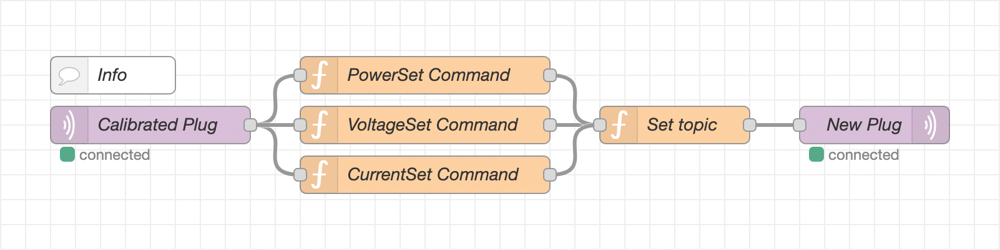

# Tasmota auto energy monitoring calibrator
Here it is reported the possibility of self-calibrating the new [Tasmota] plugs.

## Requirements
- [MQTT Server]
- [Node-RED] connected to **MQTT Server**.
- A properly calibrated plug according to [Tasmota official instructions] and connected to the **MQTT Server**.
- A new plug in the absence of calibrating with **Tasmota** and connected to the **MQTT Server**.

## Usage
1. Import the **[flow]** into **Node-RED**.
2. Modify the name of the calibrated and new devices.
3. Deploy the **[flow]** and wait until it self-calibrates.

## License
Licensed under the [Apache-2.0 License]

Read [LICENSE] for more information

[Tasmota]: https://tasmota.github.io/docs/
[MQTT Server]: https://mqtt.org/
[Node-RED]: https://nodered.org/
[Tasmota official instructions]: https://tasmota.github.io/docs/Power-Monitoring-Calibration/#calibration-procedure
[flow]: flow.json
[Apache-2.0 License]: https://opensource.org/licenses/Apache-2.0
[LICENSE]: LICENSE
